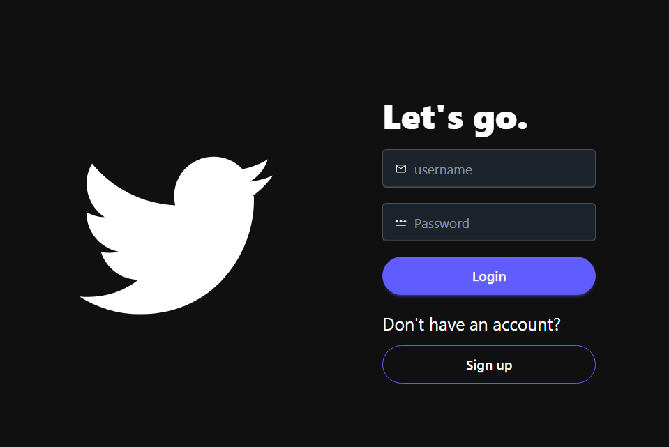
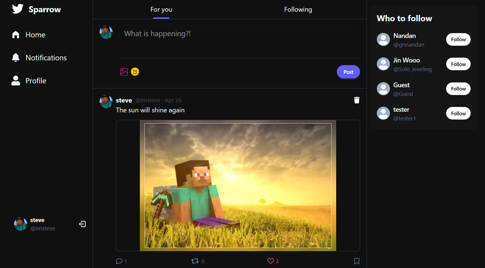
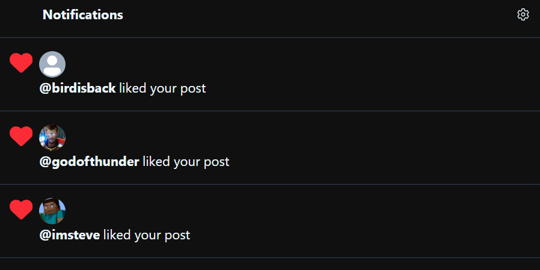
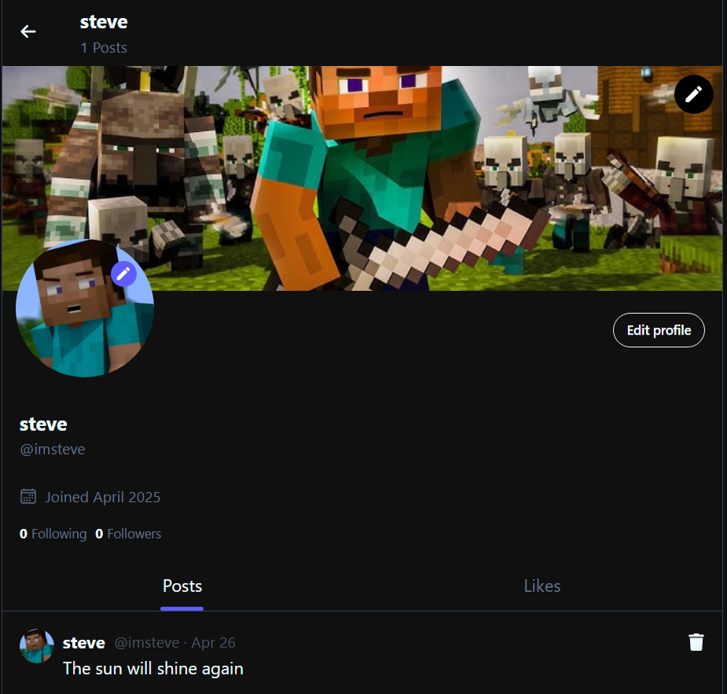
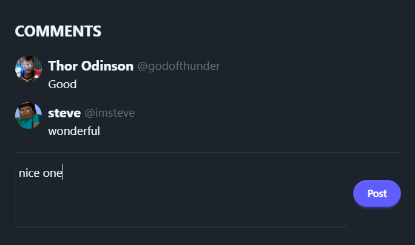
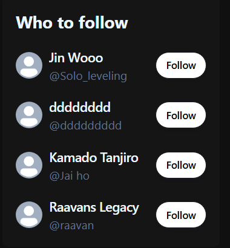
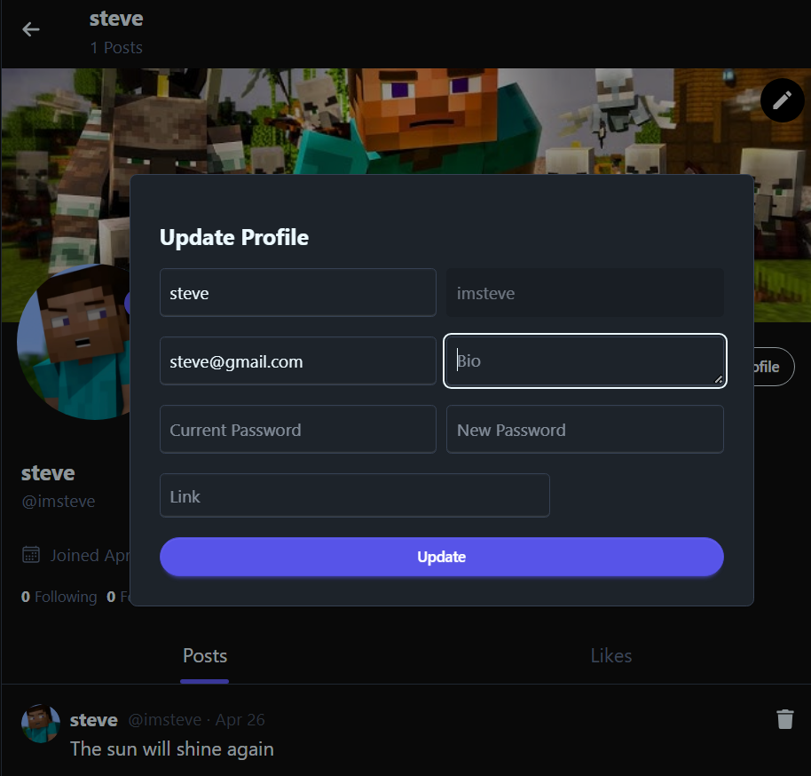

# 🐦 Sparrow – A Modern Social Media Platform

**Sparrow** is a full-stack social media web application that allows users to share moments, connect with others, and interact through posts, likes, comments, and follows. Designed with simplicity and responsiveness in mind, Sparrow offers a clean, intuitive interface that works seamlessly across devices.

🔗 **Live Site:** [https://sparrow-azld.onrender.com](https://sparrow-azld.onrender.com)

---

## 🛠️ Tech Stack

- **Frontend:** React.js, TailwindCSS, DaisyUi
- **Backend:** Node.js, Express.js
- **Database:** MongoDB
- **State Management:** Tanstack/React Query for Data Fetching, Caching etc.
- **Authentication & Security:** JWT, bcrypt, HTTP-only cookies
- **File Uploads:** Cloudinary
- **Deployment:** Render

---

## ✨ Features

- 👥 **Suggested Users to Follow**
- ✍️ **Create New Posts**
- 🗑️ **Delete Posts** (if you are the owner)
- 💬 **Comment on Posts**
- ❤️ **Like / Unlike Posts**
- 📝 **Edit Profile Information**
- 🖼️ **Change Profile & Cover Images**
- 📷 **Image Uploads** using Cloudinary
- 🔔 **Send and View Notifications**

---

## 📸 Screenshots

### 🔐 Login Page



### 🏠 Home Page

> Users can see posts from other people.  
> 

### 🔔 Notification Page

> View likes, comments, and follow notifications.  
> 

### 🙍‍♂️ Profile Page

> Shows user's posts, profile info, and other details.  
> 

### 💬 Comments Section

> Comment on posts and view all comments on a post.  
> 

### 👥 Suggested Users to Follow

> Get recommendations to follow other users.  
> 

### 📝 Update Profile Page

> Edit profile info, bio, and upload images.  
> 

---

## 🚀 Installation & Setup

### 🧾 Prerequisites

- Node.js and npm installed
- MongoDB running locally

### 🔧 Local Development Steps

1. **Build the app**

   ```bash
   npm run build

   ```

2. **Start the app**

   ```bash
   npm start

   ```

3. **Environment Setup**
   - Copy `.env.sample` to `.env` and fill in required values
